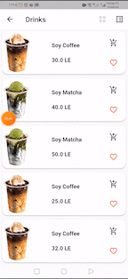
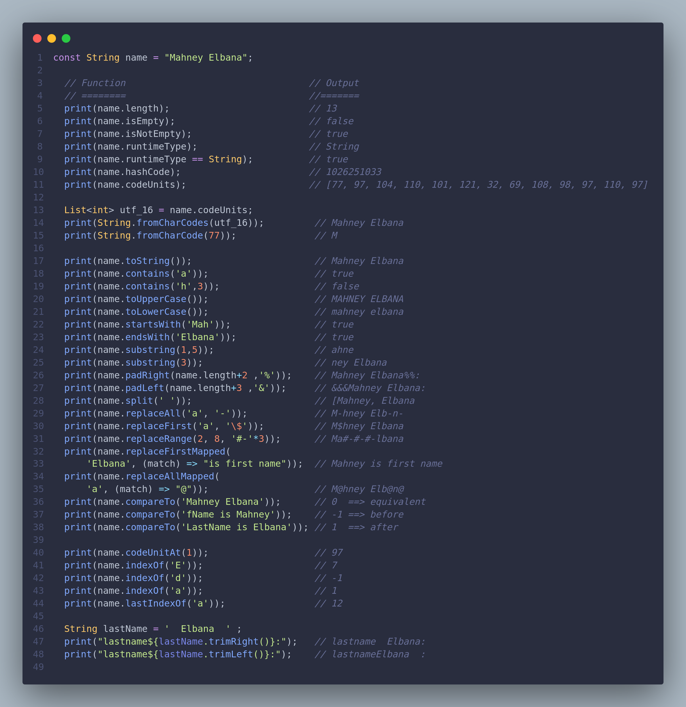

# Flutter Repository 💚

## Git && GITHUB 💙
```
git add . && git commit -m "YOUR COMMIT" && git pus 
```

## Topics 🔭

 - Flutter common commands .
 - Project Structure . 
 - upload flutter application on google play
 - Flutter Urls .
 - Algorithms . 
 - Basic Widgets .

### Flutter common commands 😊

  - How to build android app (apk) ☄️
    ```
    flutter build apk
    ```
  - How to extract (AAB) app  ☄️ 
    ```
    flutter build appbundle --release
    ```
  - How to Run flutter project ☄️
    ```
    flutter run 
    flutter run -d "device_name"
    flutter run -d linux 
    flutter run -d chrome 
    ```   
  - How to find available devices on flutter ☄️
    ```
    flutter devices 
    ``` 
  - How to create Linux files if they don't exist ☄️
    ```
    flutter create --platforms=linux .
    ``` 
  - How to create multiple platform files if they don't exist ☄️
    ```
    flutter create  .
    ```   
  - How to  delete the build/ and .dart_tool/ directories. ☄️
    ```
    flutter clean
    ``` 
  - How to create a new Flutter project in the specified directory ☄️
    ```
    flutter create "the name of project"
    ```  
  - How to add external package from [pub.dev](https://pub.dev/) ☄️
    ```
    flutter pub add "the name of package"
    ```   
  - How to manually install any package ☄️
    ```
    flutter pub get
    ```   
  - How to print inforamtion about usage certain command ☄️
    ```
    flutter run --help
    flutter run -h 
    ```

### Flutter project structure 😊

  - Where is the path of (AndroidManifest.xml) ☄️
    ```
    fluuter_project
       android 
           app 
             src
               main 
                 AndroidManifest.xml
    ```

## Github command to push the project 😄

```
git add . && git commit -m "the last commit" && git push
```

### Upload flutter application on google play 😊
  1. the videos 
    - [Flutter & Google Play Store](https://www.youtube.com/watch?v=_enL3bRiHVI)

  2. Go to Android Asset Studio to Launcher icon generator : 
   [Launcher icon generator](https://rb.gy/xlu04h) ☄️
  
  3. Go to *flutter_project/pubspec.yaml* and add *log_forground.png* in assets ☄️
     ``` pubspec.yaml
     
     dev_dependencies:
       flutter_test:
         sdk: flutter
       flutter_launcher_icons:  
     
     flutter_icons:
       android: true
       ios: true
       image_path: "assets/images/icon_logo.png"
       adaptive_icon_background: "#ffffff"
       adaptive_icon_foreground: "assets/images/log_forground.png"     
     ```
  4. Run the *flutter_launcher_icons* package ☄️
     ```  
     flutter pub get
     flutter pub run flutter_launcher_icons
     ```  
  5. Go to (Flutter Launcher Icons)[https://pub.dev/packages/flutter_launcher_icons] ☄️
  
  6. Go to the following link : [Build and release an Android app](https://docs.flutter.dev/deployment/android) ☄️
     
  7. Signing the app (Create an upload keystore) : [Signing the app](https://docs.flutter.dev/deployment/android#signing-the-app) ☄️

  8. Add the key to the following path in flutter project  ☄️
     - **flutter project** 
        - **android**
            - **app**     
                - **upload-keystore.jks**

  9.  Create file with name **key.properties** in the following path ☄️
    - **android**
       - **key.properties** 

  10. Go to this file **key.properties** and add ☄️
    - **Reference the keystore from the app**
     ```
     storePassword=password
     keyPassword=password
     keyAlias=upload
     storeFile=../app/upload-keystore.jks
     ``` 

  11. from [Signing the app] apply [**Configure signing in gradle**] in the following path ☄️
     ```
     android 
         app
          build.gradle
     ```

  12. Go to **.gitignore** and the add ☄️
     ```
     **/android/key.properties
     **/android/app/upload-keystore.jks
     ```
## Flutter Urls 😊
 - [flutter repo on github](https://github.com/MahanaElbana/flutter_repository/blob/main/README.md) ☄️
 - [Build and release an Android app](https://docs.flutter.dev/deployment/android#signing-the-app) ☄️
 - [Flutter Launcher Icons ](https://pub.dev/packages/flutter_launcher_icons) ☄️
 - [rename](https://pub.dev/packages/rename) ☄️
 - [How to upload and publish the flutter App on the Google Play Store](https://youtu.be/_enL3bRiHVI) ☄️

## Dart conclusion 🎯
 - dart_conclusion/
    - strings.dart

## animation_conclusion 🙂
  
  - built-in implicit animation 
    - such as the *AnimatedContainer* widget, 
    - which is easy to handle and has a ready-made widget.
 

## screenShot
### File source code 
```
list_view_grid_view_animation.dart
```
|challenge screen|challenge screen|
|---|---|
|||





## under updating 
```flutter
 initialRoute: Navigator.defaultRouteName,
 or 
 initialRoute:'/',
```

```

class AnimatedMainScreenDrawer extends StatefulWidget {
  const AnimatedMainScreenDrawer({Key? key}) : super(key: key);

  @override
  State<AnimatedMainScreenDrawer> createState() =>
      _AnimatedMainScreenDrawerState();
}

class _AnimatedMainScreenDrawerState extends State<AnimatedMainScreenDrawer> {
  double changedValue = 0.0;
  @override
  Widget build(BuildContext context) {
    return Scaffold(
      appBar: AppBar(
        backgroundColor: Colors.green,
        title: Text('kjkk'),
        leading: IconButton(
            icon: Icon(Icons.ac_unit_rounded),
            onPressed: () {
              setState(() {
                changedValue == 0 ? changedValue = 1.0 : changedValue = 0.0;
              });
            }),
      ),
      body: SafeArea(
        child: TweenAnimationBuilder(
          tween: Tween<double>(begin: 0.0, end: changedValue),
          duration: const Duration(milliseconds: 1000),
          builder: (__, double value, _) {
            return (
                    //////////////////////
                    Transform(
              transform: Matrix4.identity()
                ..setEntry(3, 2, 0.001)
                ..setEntry(0, 3, 200 * value)
                ..rotateY((pi / 6.0) * value),
            )
                /////////////////////
                );
          },
          child: Scaffold(
              backgroundColor: Colors.red,
              body: Text("ds"),
              appBar: AppBar(
                backgroundColor: Colors.green,
                title: Text('kjkk'),
                leading: IconButton(
                    icon: Icon(Icons.ac_unit_rounded),
                    onPressed: () {
                      setState(() {
                        changedValue == 0
                            ? changedValue = 1.0
                            : changedValue = 0.0;
                      });
                    }),
              )),
        ),
      ),
    );
  }
}

```
# ght

```
  Widget buildBottomNavigation() => BottomNavigationBar(
        elevation: 0,
        unselectedItemColor: Colors.white54,
        selectedItemColor: Colors.white,
        backgroundColor: Colors.transparent,
        showSelectedLabels: false,
        showUnselectedLabels: false,
        items:const [
          BottomNavigationBarItem(
            icon: Icon(Icons.pin_drop_outlined),
            label: '',
          ),
          BottomNavigationBarItem(
            icon: Icon(Icons.add_location),
            label: '',
          ),
          BottomNavigationBarItem(
            icon: Icon(Icons.person_outline),
            label: '',
          ),
        ],
      );

```
## Flutte Route

```dart
class RoutePage {
  static Route? onRoutePage(RouteSettings setting) {
    if (setting.name == Navigator.defaultRouteName) {
      return MaterialPageRoute(
        builder: (_) => const HomeScreen(),
      );
    } else if (setting.name == ScreenName.drawerScreen) {
      return MaterialPageRoute(
        builder: (_) => const ZoomDrawerScreen(),
      );
    } else if (setting.name == ScreenName.cardListAnimation) {
      return MaterialPageRoute(
        builder: (_) => const CardListAnimation(),
      );
    } else if (setting.name == ScreenName.subCategories) {
      return MaterialPageRoute(
        builder: (_) => const SubCategories(),
      );
    } else if (setting.name == ScreenName.transformOne) {
      return MaterialPageRoute(
        builder: (_) => const TransformOne(),
      );
    }
    // ====================== if route not founded ================//
    else {
      return MaterialPageRoute(
        builder: (_) {
          return Scaffold(
            appBar: AppBar(
              title: const Text('Route NOT FOUND !'),
            ),
            body: const Text('Route NOT FOUND !'),
          );
        },
      );
    }
    // ====================== if route not founded ================//
  }
}
```

```dart
 PopupMenuButton<int>(
            initialValue: view,
            onSelected: (int index) {
              if (view != index) {
                view = index;
              }
              Navigator.of(context).pushReplacement(
                  _createRoute(const ListViewGridViewAnimation()));
            },
            itemBuilder: (BuildContext context) {
              return <PopupMenuEntry<int>>[
                const PopupMenuItem<int>(
                  value: 1,
                  child: Text('Switch to GridView'),
                ),
                const PopupMenuDivider(),
                const PopupMenuItem<int>(
                  value: 2,
                  child: Text('Switch to ListView'),
                ),
                const PopupMenuDivider(),
              ];
            },
          ),
        ],
        elevation: 0.0,
      ),
```

```dart
import 'dart:math';
import 'dart:ui';

import 'package:flutter/material.dart';

import 'package:cards_animation/details.dart';
import 'package:cards_animation/widgets/cards.dart';

class CardsHome extends StatelessWidget {
  const CardsHome({Key? key}) : super(key: key);

  @override
  Widget build(BuildContext context) {
    return Scaffold(
      backgroundColor: Colors.white,
      appBar: AppBar(
        elevation: 0,
        iconTheme: const IconThemeData(
          color: Colors.black87,
        ),
        backgroundColor: Colors.white,
        title: const Text(
          'My Playlist',
          style: TextStyle(color: Colors.black87),
        ),
        leading: IconButton(
          icon: const Icon(Icons.menu),
          onPressed: () => Navigator.of(context).maybePop(),
        ),
        actions: [
          IconButton(
            icon: const Icon(Icons.search),
            onPressed: () => null,
          ),
        ],
      ),
      body: Column(
        children: const [
           Expanded(
            flex: 3,
            child: CardsBody(),
          ),
           Expanded(
            flex: 2,
            child:  CardsHorizontal(),
          ),
        ],
      ),
    );
  }
}

class CardsBody extends StatefulWidget {
  const CardsBody({Key? key}) : super(key: key);

  @override
  _CardsBodyState createState() => _CardsBodyState();
}

class _CardsBodyState extends State<CardsBody> with TickerProviderStateMixin {
  bool _selectedMode = false;
  late AnimationController _animationControllerSelection;
  late AnimationController _animationControllerMovement;
  int? _selectedIndex;

  Future<void> _onCardSelected(Card3D card, int index) async {
    setState(() {
      _selectedIndex = index;
    });
    const duration = Duration(milliseconds: 650);
    _animationControllerMovement.forward();
    await Navigator.of(context).push(
      PageRouteBuilder(
        transitionDuration: duration,
        reverseTransitionDuration: duration,
        pageBuilder: (context, animation, _) => FadeTransition(
          opacity: animation,
          child: CardsDetails(
            card: card,
          ),
        ),
      ),
    );
    _animationControllerMovement.reverse(from: 1.0);
  }

  int _getCurrentFactor(int currentIndex) {
    if (_selectedIndex == null || currentIndex == _selectedIndex) {
      return 0;
    } else if (currentIndex > _selectedIndex!) {
      return -1;
    } else {
      return 1;
    }
  }

  @override
  void initState() {
    _animationControllerSelection = AnimationController(
      vsync: this,
      lowerBound: 0.15,
      upperBound: 0.5,
      duration: const Duration(milliseconds: 500),
    );
    _animationControllerMovement = AnimationController(
      vsync: this,
      duration: const Duration(milliseconds: 750),
    );
    super.initState();
  }

  @override
  void dispose() {
    _animationControllerSelection.dispose();
    _animationControllerMovement.dispose();
    super.dispose();
  }

  @override
  Widget build(BuildContext context) {
    return LayoutBuilder(builder: (context, constraints) {
      return AnimatedBuilder(
          animation: _animationControllerSelection,
          builder: (context, snapshot) {
            final selectionValue = _animationControllerSelection.value;
            return GestureDetector(
              onTap: () {
                if (!_selectedMode) {
                  _animationControllerSelection.forward().whenComplete(() {
                    setState(() {
                      _selectedMode = true;
                    });
                  });
                } else {
                  _animationControllerSelection.reverse().whenComplete(() {
                    setState(() {
                      _selectedMode = false;
                    });
                  });
                }
              },
              child: Transform(
                alignment: Alignment.center,
                transform: Matrix4.identity()
                  ..setEntry(3, 2, 0.001)
                  ..rotateX(selectionValue),
                child: AbsorbPointer(
                  absorbing: !_selectedMode,
                  child: Container(
                    height: constraints.maxHeight,
                    width: constraints.maxWidth * 0.6,
                    color: Colors.white,
                    child: Stack(
                      clipBehavior: Clip.none,
                      children: List.generate(
                        4,
                        (index) => Card3DItem(
                          height: constraints.maxHeight / 2,
                          card: cardList[index],
                          percent: selectionValue,
                          depth: index,
                          verticalFactor: _getCurrentFactor(index),
                          animation: _animationControllerMovement,
                          isForward: _animationControllerMovement.status ==
                              AnimationStatus.forward,
                          onCardSelected: (card) {
                            _onCardSelected(card, index);
                          },
                        ),
                      ).reversed.toList(),
                    ),
                  ),
                ),
              ),
            );
          });
    });
  }
}

class Card3DItem extends AnimatedWidget {
  const Card3DItem({
    Key? key,
    this.card,
    this.percent,
    this.height,
    this.depth,
    this.onCardSelected,
    this.verticalFactor = 0,
    this.isForward = false,
    required Animation<double> animation,
  }) : super(key: key, listenable: animation);

  final Card3D? card;
  final double? percent;
  final double? height;
  final int? depth;
  final ValueChanged<Card3D>? onCardSelected;
  final int verticalFactor;
  final bool isForward;

  Animation<double> get animation => listenable as Animation<double>;

  @override
  Widget build(BuildContext context) {
    const depthFactor = 50.0;
    final bottomMargin = height! / 6.0;

    return Positioned(
      left: 0,
      right: 0,
      top: height! + -depth! * height! / 2.0 * percent! - bottomMargin,
      child: Opacity(
        opacity:
            verticalFactor == 0 ? 1 : (isForward ? (1 - animation.value) : 1.0),
        child: Hero(
          tag: card!.title!,
          flightShuttleBuilder: (context, animation, flighDirection,
              fromHeroContext, toHeroContext) {
            Widget _current;
            double _depth = 0.0;

            if (flighDirection == HeroFlightDirection.push) {
              _current = toHeroContext.widget;
            } else {
              _current = fromHeroContext.widget;
              _depth = depth! * lerpDouble(0.0, depthFactor, animation.value)!;
            }

            return AnimatedBuilder(
              animation: animation,
              builder: (context, _) {
                final newValue = lerpDouble(0.5, 2 * pi, animation.value)!;
                return Transform(
                  alignment: Alignment.center,
                  transform: Matrix4.identity()
                    ..setEntry(3, 2, 0.001)
                    ..translate(0.0, 0.0, _depth)
                    ..rotateX(newValue),
                  child: _current,
                );
              },
            );
          },
          child: Transform(
            alignment: Alignment.center,
            transform: Matrix4.identity()
              ..setEntry(3, 2, 0.001)
              ..translate(
                0.0,
                verticalFactor *
                    animation.value *
                    MediaQuery.of(context).size.height,
                depth! * depthFactor,
              ),
            child: GestureDetector(
              onTap: () {
                onCardSelected!(card!);
              },
              child: SizedBox(
                height: height,
                child: Card3DWidget(
                  card: card,
                ),
              ),
            ),
          ),
        ),
      ),
    );
  }
}

class Card3DWidget extends StatelessWidget {
  const Card3DWidget({Key? key, this.card}) : super(key: key);

  final Card3D? card;

  @override
  Widget build(BuildContext context) {
    final border = BorderRadius.circular(15.0);
    return PhysicalModel(
      color: Colors.white,
      elevation: 10,
      borderRadius: border,
      child: ClipRRect(
        borderRadius: border,
        child: Image.asset(
          card!.image!,
          fit: BoxFit.cover,
        ),
      ),
    );
  }
}

class CardsHorizontal extends StatelessWidget {
  const CardsHorizontal({Key? key}) : super(key: key);

  @override
  Widget build(BuildContext context) {
    final bottom = MediaQuery.of(context).viewPadding.bottom;
    return Padding(
      padding: const EdgeInsets.symmetric(vertical: 15.0),
      child: Column(
        crossAxisAlignment: CrossAxisAlignment.start,
        children: [
          const Padding(
            padding: EdgeInsets.symmetric(horizontal: 20, vertical: 10),
            child: Text(
              'Recently Played',
              style: TextStyle(
                color: Colors.black54,
                fontWeight: FontWeight.bold,
              ),
            ),
          ),
          Expanded(
            child: ListView.builder(
                scrollDirection: Axis.horizontal,
                itemCount: cardList.length,
                itemBuilder: (context, index) {
                  final card = cardList[index];
                  return Padding(
                    padding: EdgeInsets.only(
                        top: 20.0, bottom: 45 + bottom, right: 20, left: 20),
                    child: Card3DWidget(card: card),
                  );
                }),
          ),
        ],
      ),
    );
  }
}
```

# CustomCliper 